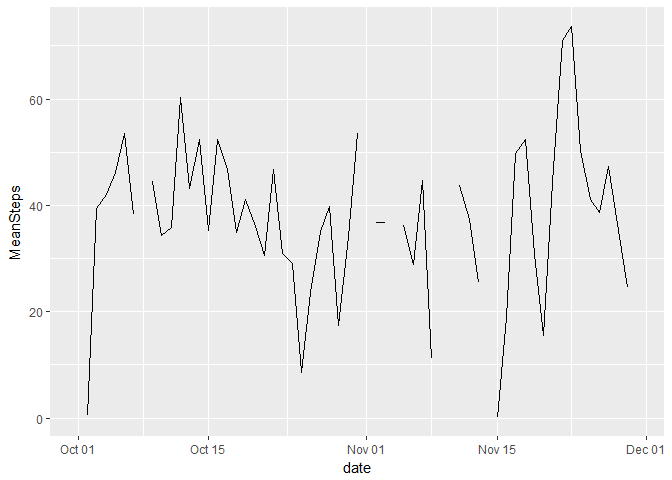
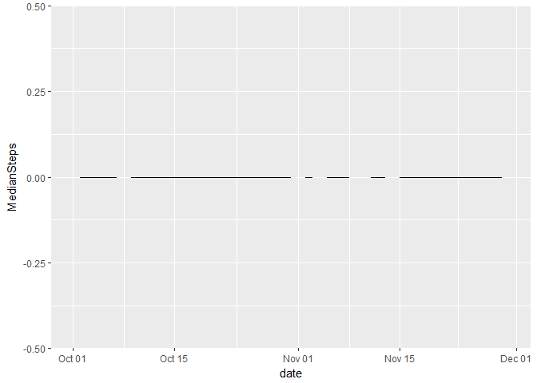
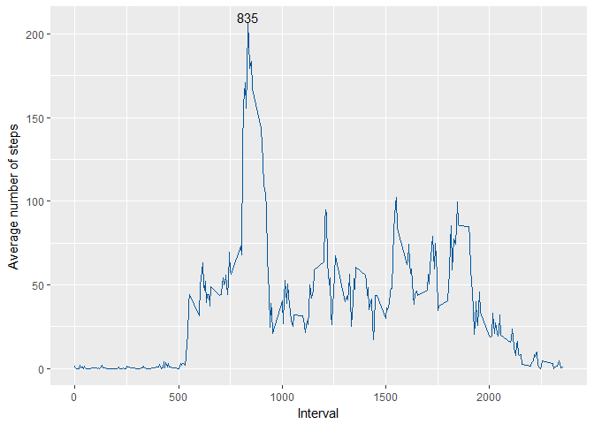
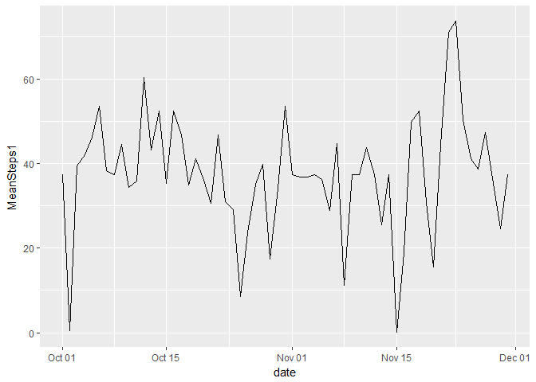
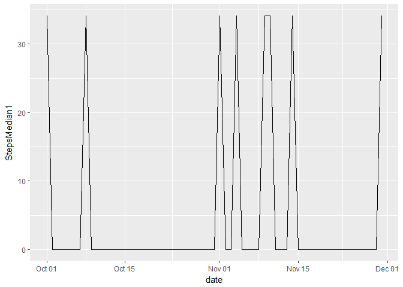
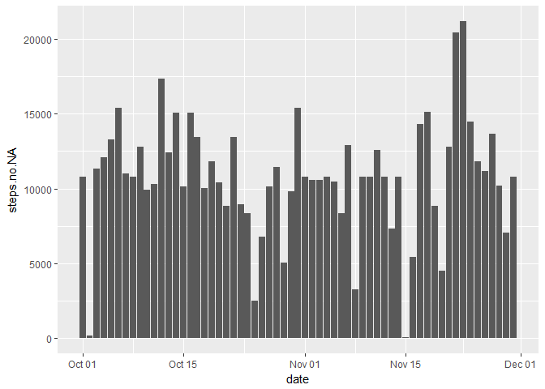
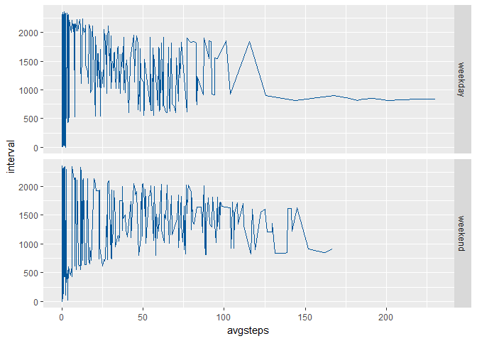

Nitika  
19 July 2017  


###1. Loading and Preprocessing the Data


```r
mydata<- read.table(file = "activity.csv", header = TRUE, sep=",",na.strings = "NA")
mydata$date <- as.Date(mydata$date,"%Y-%m-%d")
str(mydata)
```

```
## 'data.frame':	17568 obs. of  3 variables:
##  $ steps   : int  NA NA NA NA NA NA NA NA NA NA ...
##  $ date    : Date, format: "2012-10-01" "2012-10-01" ...
##  $ interval: int  0 5 10 15 20 25 30 35 40 45 ...
```
The activities data is loaded. Date attribute is formatted during preprocessing.

###2. Total number of steps taken each day

```r
g<- ggplot(data=mydata, aes(date, steps)) + geom_histogram(stat="identity")
g
```

<!-- -->

The histogram shows number of steps that have been taken on daily basis.

###3. Mean and Median number of steps taken each day

```r
meansteps<- aggregate(mydata$steps, by=list(mydata$date), mean, na.rm=TRUE)
names(meansteps)<- make.names(c("date","MeanSteps"))
mediansteps<- aggregate(mydata$steps, by=list(mydata$date), FUN=median, na.rm=TRUE)
names(mediansteps)<- make.names(c("date","MedianSteps"))
ggplot(meansteps, aes(date,MeanSteps))+ geom_line()
```

<!-- -->

```r
ggplot(mediansteps, aes(date,MedianSteps))+ geom_line()
```

<!-- -->

The above two graphs shows Mean and Median number of steps taken each day.

###4. Average daily activity pattern


```r
AvgInterval<- aggregate(mydata$steps, by=list(mydata$interval), mean, na.rm=TRUE)
names(AvgInterval)<- make.names(c("interval","AvgSteps"))
maxAvg<-AvgInterval[ which.max(AvgInterval$AvgSteps),]

ggplot(data=AvgInterval, aes(x=interval, y=AvgSteps)) + geom_line( color="#005599") + theme(legend.position ="none")+ xlab("Interval")+ylab("Average number of steps") + geom_text(data=maxAvg,aes(x=interval, y=AvgSteps,label= maxAvg$interval), vjust=-.1)
```

<!-- -->

Graph shows that the Average number of steps were maximum in interval 835.

###5. Imputing Missing Values
####5.1 Total number of missing values in the dataset(i.e. the total number of rows with NAs)

```r
na.total<- sum(is.na(mydata[,1]))
```
The total number of rows with NA are 2304. This number can't be ignored, hence, imputing NA with average no. of steps for the interval. Adding new column to "mydata1" dataset.


```r
steps.no.NA<- numeric(nrow(mydata))
for(i in 1:nrow(mydata)){
  if(is.na(mydata[i,"steps"])){
    steps.no.NA[i]<- AvgInterval[which(AvgInterval$interval==mydata[i,"interval"]),"AvgSteps"]
  }
  else{
    steps.no.NA[i]<- mydata[i,"steps"]
  }
}
mydata1<- cbind(mydata,steps.no.NA)
```

####5.2 Mean and Median number of steps taken each day after imputing NA


```r
meansteps1<- aggregate(mydata1$steps.no.NA, by=list(mydata1$date), mean, na.rm=TRUE)
names(meansteps1)<- make.names(c("date","MeanSteps1"))
mediansteps1<- aggregate(mydata1$steps.no.NA, by=list(mydata1$date), FUN=median, na.rm=TRUE)
names(mediansteps1)<- make.names(c("date","StepsMedian1"))
ggplot(meansteps1, aes(date,MeanSteps1))+ geom_line()
```

<!-- -->

```r
ggplot(mediansteps1, aes(date,StepsMedian1))+ geom_line()
```

<!-- -->

It can be noticed in the graphs that after imputing missing values, the mean did not change(since we replaced NA with mean value) but the graph has become connected. The median has been changed due to imputation.
####5.3 Average daily activity pattern


```r
g<- ggplot(data=mydata1, aes(date, steps.no.NA)) + geom_histogram(stat="identity")
g
```

<!-- -->

As compared to the previous graph showing Average daily activity pattern with missing data, this graph after imputing mean value contains average no. of daily steps for each day.

####5.4 Differences in activity patterns between weekdays and weekends


```r
mydata1$is.weekday<- weekdays(mydata1$date)
for(i in 1:nrow(mydata1))
{if (mydata1$is.weekday[i] %in% c("Saturday", "Sunday")){
  mydata1$is.weekday[i]<- "weekend"
}
  else{
  mydata1$is.weekday[i]<- "weekday"
}}
IntAvgSteps<- aggregate(mydata1$steps.no.NA, by=list(mydata1$interval,mydata1$is.weekday), mean, na.rm=TRUE)
names(IntAvgSteps)<- make.names(c("interval","Day","avgsteps"))

par(mfrow=c(2,1), mar=c(4,2,2,1))
g<- ggplot(IntAvgSteps, aes(avgsteps,interval)) + facet_grid(Day~.)+ geom_line(color="#005599")
g
```

<!-- -->

The graph shows that the average number of steps taken during interval 750 to 1000 are much higher during Weekdays as compared to Weekends. For rest of the intervals, average number of steps are almost same.
